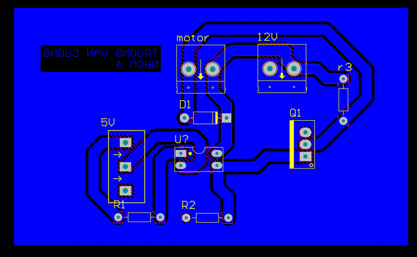
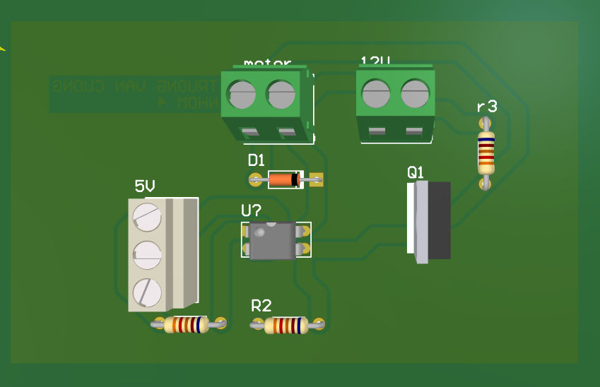
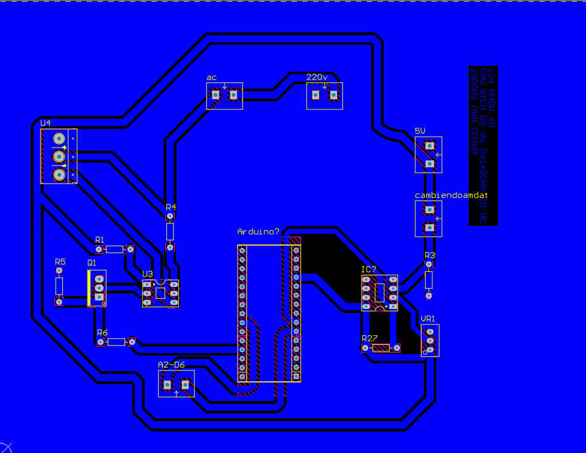
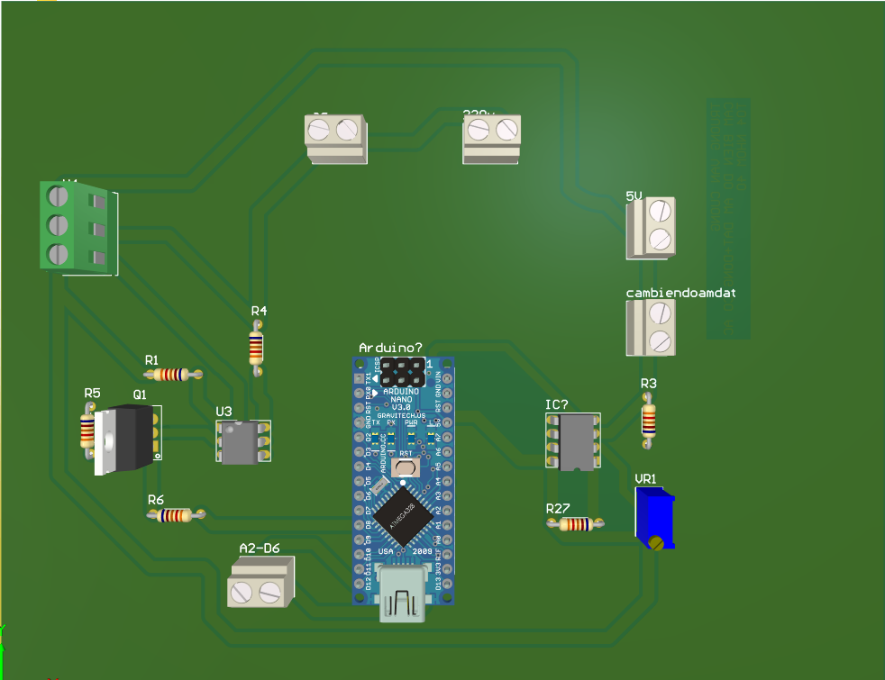
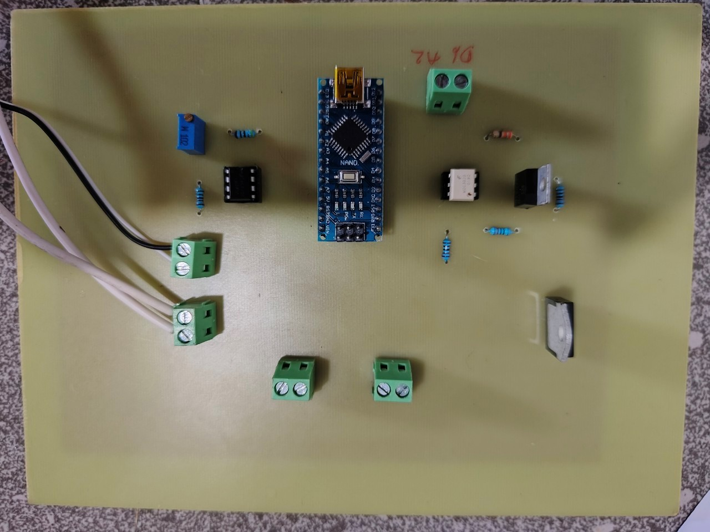
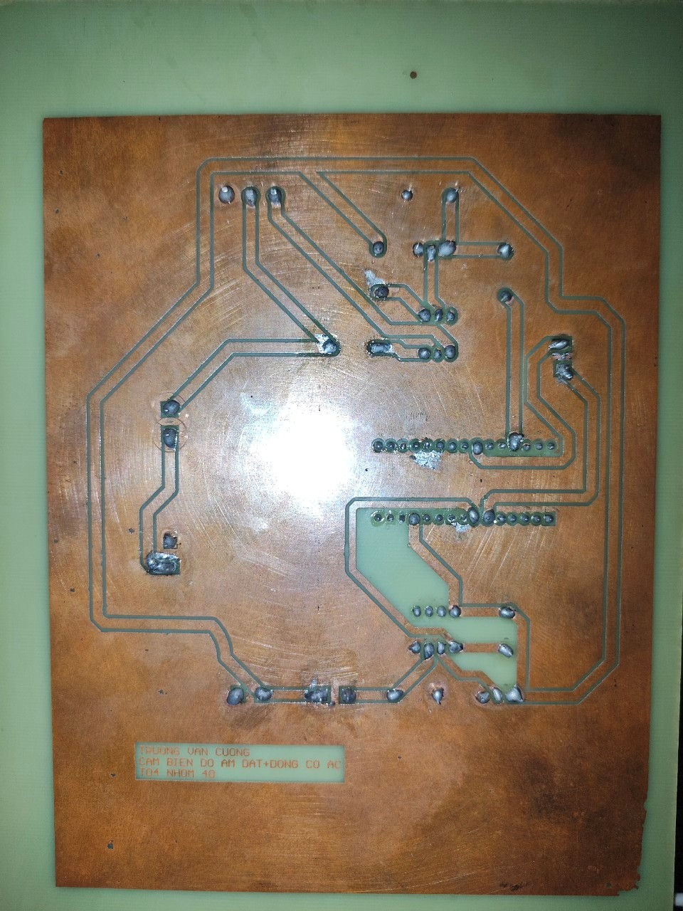

# README

## Mô tả
- Thực tập chuyên ngành thực hiện các bài tập thiết kế mạch điện tử.  
- Nội dung gồm: thiết kế mạch 2D, mô phỏng 3D và sản phẩm thực tế.  
- Mục tiêu: áp dụng kiến thức điện tử công suất, thiết kế mạch, và thực hành lắp ráp.  

---

# Thực tập chuyên ngành (TTCN)

### Bài 1: ĐIỀU KHIỂN ĐỘNG CƠ BẰNG MOSFET KÊNH N
- **2D**  
  

- **3D**  
  

### Bài 2: THIẾT KẾ MẠCH NHÀ KÍNH

#### Nhiệm vụ cá nhân
-  Thiết kế và thi công mạch cảm biến độ ẩm đất và mạch điều khiển động cơ AC

- **2D**  
  

- **3D**  
  

### Sản phẩm
- **Ảnh sản phẩm 1**  
  

- **Ảnh sản phẩm 2**  
  
